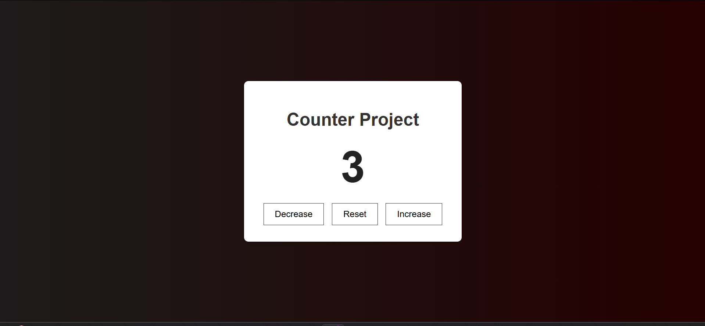
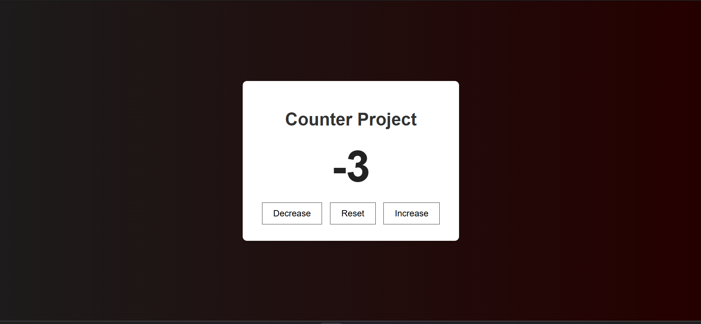
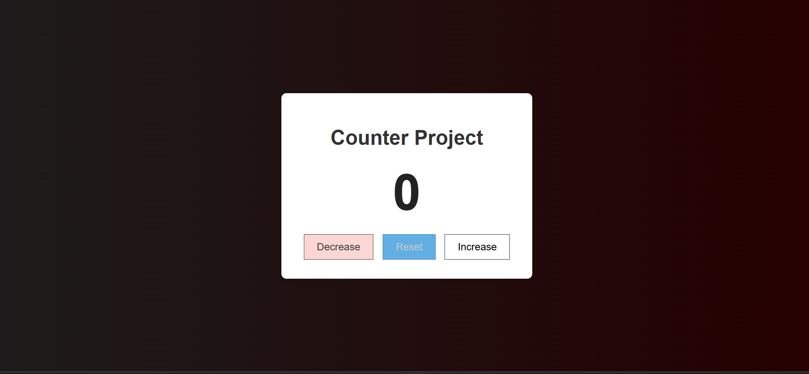

# ⚡ Counter App

A simple and interactive counter application built using **JavaScript DOM manipulation**.

---

## 📖 Description
This project is a basic counter app that allows users to **increment**, **decrement**, and **reset** a number value in real time using button interactions.

---

## ✨ Features
- ➕ Increment counter value  
- ➖ Decrement counter value  
- 🔄 Reset counter to zero  
- ⚡ Real-time UI updates  

---

## 🧠 Concepts Used
- 🧩 DOM manipulation  
- 🎯 Event listeners  
- 📊 Basic state management  
- 🔁 UI re-rendering logic  

---

## 📸 App Preview

> 🖼️ Replace image paths with your actual screenshots

### 🔼 Increment Action

  

### 🔽 Decrement Action

  

### 🔄 Reset Action

  

---

## 🚀 How to Run
- Open `index.html` in your browser  
- Click buttons to interact with the counter  

---

## 📌 Project Goal
This project was created to practice **fundamental JavaScript logic, DOM interaction, and event handling**.

---

## 👨‍💻 Author
**Mustafe-xasan**
