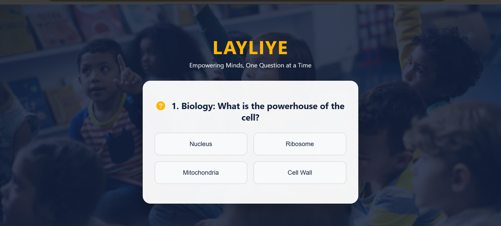
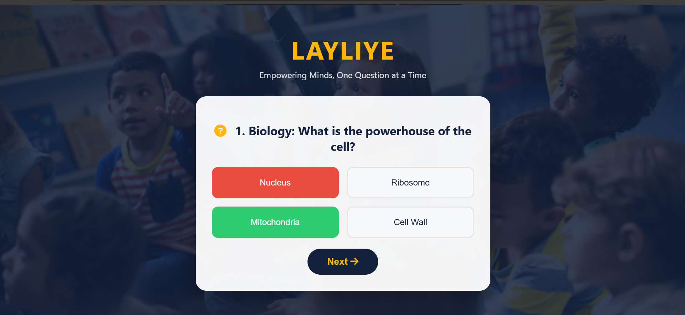
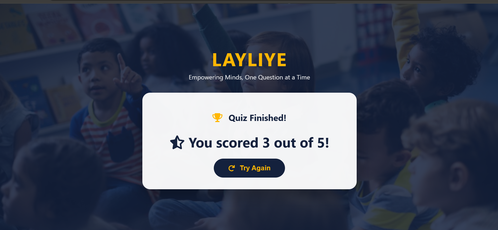

# 🧠 Layliye – School Quiz App

An interactive multiple‑choice quiz application built with **JavaScript, HTML, and CSS**. Test your knowledge across biology, chemistry, physics, and geography with instant feedback and a final score.

---

## 📖 Description
This quiz app presents a series of questions with four answer options each. Users select an answer, receive immediate visual feedback (green for correct, red for wrong), and then proceed to the next question. At the end, the app displays the total score out of the number of questions. The design features a glass‑morphism card, icons, and a student‑friendly theme.

---

## ✨ Features
- ❓ Multiple‑choice questions with 4 options  
- ✅ Instant feedback on answer selection  
- 🔒 Disables buttons after answering to prevent changes  
- 📊 Final score display with encouragement  
- 🔁 Option to restart the quiz  
- 🎨 Clean UI with hover effects and responsive layout  
- 📱 Works on mobile and desktop  

---

## 🧠 Concepts Used
- 🧩 DOM manipulation (`createElement`, `innerHTML`, `classList`)  
- 📦 Arrays of objects to store questions and answers  
- 🔁 Loops and array methods (`forEach`)  
- 🖱️ Event listeners and dynamic button creation  
- 🎨 CSS Grid for answer buttons, flexbox for layout  
- 📱 Media queries for responsive design  

---

## 📸 App Preview

### 🖥️ Quiz Question Screen

  

### ✅ Correct Answer Feedback

  

### 🏆 Final Score Screen

  

---

## 🚀 How to Run
1. Clone or download the project folder.  
2. Make sure the `assets/students.jpg` exists (or update the CSS background image path).  
3. Open `index.html` in any modern web browser.  
4. Answer each question by clicking on a choice.  
5. Click **Next** to proceed. After the last question, your score will be shown.  
6. Click **Try Again** to restart the quiz.

---

## 📌 Project Goal
This project was built to practice **dynamic UI generation, state management, and user interaction** – creating a complete quiz experience without any external libraries, focusing on clean JavaScript logic and responsive design.

---

## 👨‍💻 Author
**Mustafe-xasan**