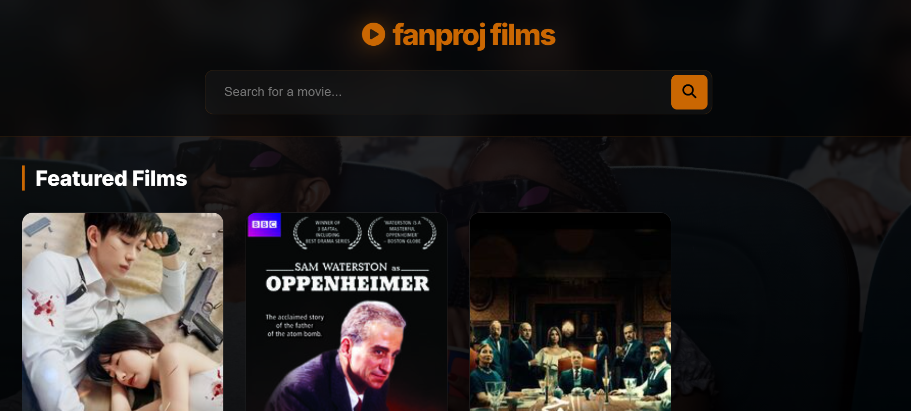
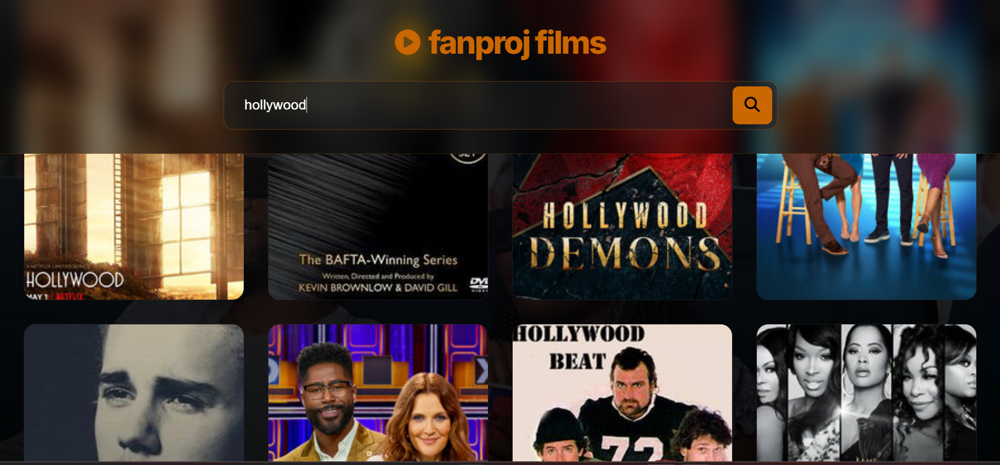

# 🎬 fanproj films – Movie Search App

A simple and beautiful movie search app. You can see some featured movies when you open it, and you can search for any movie you like. It uses the TVmaze API to get movie information.

## 📖 About This Project

This is a movie search website. It has a dark and stylish design. When you open the page, you will see a list of popular movies. You can type a movie name in the search box and find more movies. Each movie shows a poster picture. When you move your mouse over a movie, its name appears with a nice animation.

The app is easy to use and looks like a premium movie service.

## ✨ Features

- 🎬 **Featured movies** – Shows a list of well-known movies when the page loads.
- 🔍 **Search movies** – Type any movie name and press Enter or click the search button.
- 🖼️ **Movie posters** – Displays posters for each movie (if available).
- ✨ **Nice design** – Dark theme with blur effects and orange accents.
- 📱 **Works on all devices** – The layout changes to fit phones, tablets, and computers.
- ⚡ **Fast and smooth** – Fetches data from the TVmaze API without reloading the page.
- 🧹 **Handles errors** – Shows a message if no movie is found or if something goes wrong.

## 🧠 Things I Used to Build This

- 🧩 **JavaScript** – To change the page content, handle clicks, and work with data.
- 🌐 **TVmaze API** – To get movie and show details from the internet.
- 🖱️ **Event listeners** – To react when you type, press Enter, or click the button.
- 🔁 **Loops** – To go through lists of movies and show them one by one.
- 🎨 **CSS** – For colors, animations, card layouts, and responsive design.
- 🧊 **Glass effect** – Used blur and transparency to make the design modern.
- 📱 **Responsive grid** – Uses CSS Grid to arrange movie cards nicely on any screen.

## 📸 App Preview

### Home Page – Featured Films
🏠 Home Page – Featured Films

  

🔍 Search Results Example

  

## 🚀 How to Run the App

1. Download or clone this project folder to your computer.
2. Put a background image named `bg.jpg` inside the `assets/` folder (optional).
3. Open the file **`index.html`** in your web browser (like Chrome, Firefox, or Edge).
4. You will see the featured movies right away.
5. Type a movie name in the search box and press **Enter** or click the **search icon**.
6. Hover over any movie card to see its title.
7. The app gets all movie data from the TVmaze website – you don't need to install anything.

## 📌 What I Wanted to Learn

This project helped me practice working with an online API, using `fetch` and `async/await` to get data, and making a nice-looking user interface. I also learned how to handle loading states, show error messages, and design a page that looks good on any device – all without using any libraries or frameworks.

## 👨‍💻 Author

**Mustafe-xasan**

---

Made with ❤️ for movie fans
