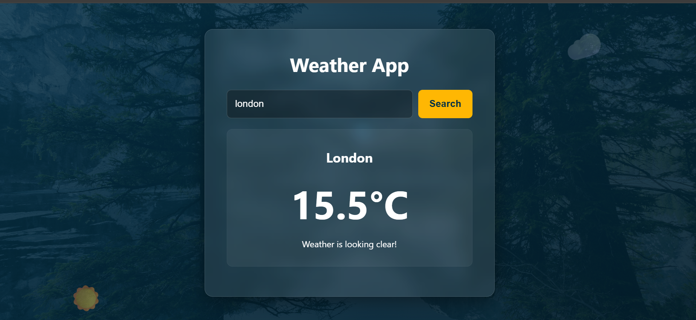

# ☀️ Simple Weather App

A clean and modern weather app that shows you the current temperature for any city. Just type a city name and get the weather instantly – built with JavaScript, HTML, and CSS.

## 📖 About This Project

This is a simple weather application. You type a city name in the search box, and the app shows you the current temperature. It uses two different APIs to find your city and get the weather data. The design has a dark blue background with a glass-like card in the center. Floating weather icons like ☀️, ☁️, and 🌧️ move slowly in the background, making the app look alive.

The app is easy to use and works on phones, tablets, and computers.

## ✨ Features

- 🔍 **Search for any city** – Type a city name and press Enter or click Search.
- 🌡️ **Shows current temperature** – Displays the temperature in degrees Celsius.
- 📍 **Finds your city** – Uses a geocoding API to find the correct location.
- 🖼️ **Beautiful glass design** – A modern card with blur effect and a dark background.
- ☁️ **Floating weather icons** – Animated icons move slowly in the background.
- ❌ **Handles errors** – Shows a message if city is not found or if something goes wrong.
- 📱 **Works on all devices** – The card adjusts to fit any screen size.

## 🧠 Things I Used to Build This

- 🧩 **JavaScript (DOM)** – To update the page content based on user input.
- 🌐 **Open-Meteo API** – To get weather data and geocoding information.
- 🔄 **Async/Await** – To fetch data from APIs without freezing the page.
- 🖱️ **Event Listeners** – To detect clicks and Enter key presses.
- 🎨 **CSS** – For the glass effect, animations, and responsive layout.
- ✨ **Keyframe Animations** – To make the floating icons move smoothly.
- 🧊 **Backdrop Filter** – To create the blur effect on the weather card.
- 📱 **Responsive Design** – Uses flexible layouts that work on any screen.

## 📸 App Preview

### 🏠 Weather Home Page

  

### 🔍 Search Results Example

  

## 🚀 How to Run the App

1. Download or clone this project folder to your computer.
2. Make sure you have a background image named `bg.jpg` inside the `assets/` folder.
3. Open the file **`index.html`** in your web browser (like Chrome, Firefox, or Edge).
4. Type a city name (like "London" or "Tokyo") in the search box.
5. Press **Enter** or click the **Search** button.
6. The app will show the current temperature for that city.
7. If the city is not found, you will see an error message.

## 📌 What I Wanted to Learn

This project helped me practice working with **multiple APIs** (geocoding and weather), handling **asynchronous JavaScript**, and creating a **polished user interface**. I also learned how to use **CSS animations** to make floating icons and how to apply the **glass-morphism** effect for a modern look – all without using any external libraries.

## 👨‍💻 Author

**Mustafe-xasan**

---

Made with ☀️ for everyone who loves checking the weather
