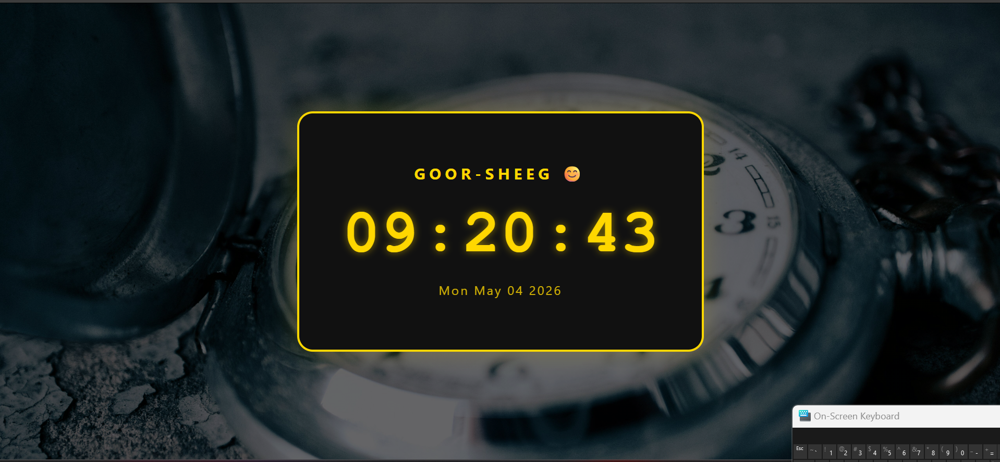

# ⚡ Goor-Sheeg Digital Clock

A sleek and real-time digital clock application built with **JavaScript** and **DOM manipulation**.

---

## 📖 Description
This project displays the current time (hours, minutes, seconds) and the full date in a stylish, continuously updating interface. It’s designed to be a functional and visually appealing clock with a dark theme and golden accents.

---

## ✨ Features
- 🕒 Real‑time updating digital clock (24‑hour format)
- 📅 Displays current weekday, month, day, and year
- 🖼️ Full‑screen background image with a dark overlay
- 📱 Fully responsive layout for mobile devices
- ✨ Smooth glowing text effect

---

## 🧠 Concepts Used
- 🧩 DOM manipulation (`getElementById`, `innerHTML`)
- ⏱️ `setInterval()` for real‑time updates
- 📅 JavaScript `Date` object and formatting methods
- 🎨 CSS gradients, overlays, and media queries
- 🔁 Event‑driven UI re‑rendering

---

## 📸 App Preview

> 🖼️ Replace the image paths with your actual screenshots

### 🖥️ Main Clock Display

  

---

## 🚀 How to Run
1. Clone or download the project folder.
2. Make sure the `assets/stopwatch img.jpg` exists (or update the CSS background image path).
3. Open `index.html` in any modern web browser.
4. The clock will start updating automatically every second.

---

## 📌 Project Goal
This project was created to practice **real‑time DOM updates**, working with the `Date` object, and building a clean, responsive UI with CSS.

---

## 👨‍💻 Author
**Mustafe-xasan**
