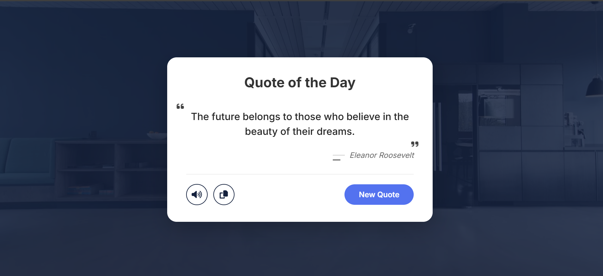

# 💬 Random Quote Generator

A fully interactive quote generator built with **JavaScript**, featuring text-to-speech, copy-to-clipboard, and a smooth loading animation.

---

## 📖 Description
This project displays a new inspirational quote with its author each time the user clicks the **New Quote** button. Additional features allow the user to **listen** to the quote (speech synthesis) and **copy** the quote text to the clipboard. The design uses a modern card layout with a full‑screen background image and overlay.

---

## ✨ Features
- 🎲 **Random quote** from a curated list on button click
- 🔊 **Speak** the quote aloud using the browser’s SpeechSynthesis API
- 📋 **Copy** the quote text to clipboard with visual feedback
- ⏳ **Loading effect** while fetching a new quote
- 🎨 **Responsive design** with a dark overlay and clean card UI

---

## 🧠 Concepts Used
- 📦 JavaScript arrays and objects
- 🧩 DOM manipulation (`getElementById`, `innerText`)
- 🔊 Web Speech API (`SpeechSynthesisUtterance`)
- 📋 Clipboard API (`navigator.clipboard`)
- ⏱️ `setTimeout` for simulated loading state
- 🎨 CSS Grid / Flexbox, pseudo‑elements, hover effects
- 📱 Media queries for mobile responsiveness

> 💡 This project was a tough learning experience. I heavily used **YouTube tutorials**, **GeeksforGeeks**, **Stack Overflow**, and various code snippets to implement the speech and copy functionalities.

---

## 📸 App Preview

> 🖼️ Replace the image paths with your actual screenshots

### 🖥️ Main Quote Card

  

---

## 🚀 How to Run
1. Clone or download the project folder.
2. Make sure the `assets/bg.jpg` exists (or update the CSS background image path).
3. Open `index.html` in any modern web browser.
4. Click **New Quote** to generate a random quote.  
   - Click the **speaker icon** to hear the quote.  
   - Click the **copy icon** to copy the quote text.

---

## 📌 Project Goal
This project was built to master **real‑world DOM interactions**, asynchronous feedback (loading states), browser APIs (speech & clipboard), and building a polished, user‑friendly interface from scratch.

---

## 👨‍💻 Author
**Mustafe-xasan**
