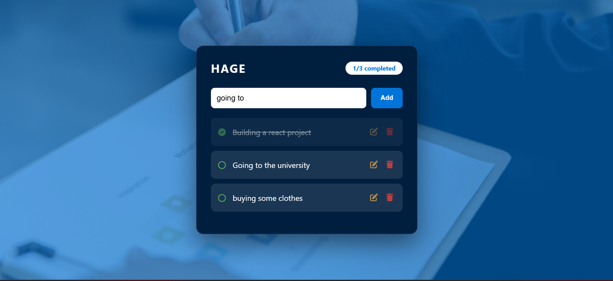

# ✅ Hage To‑Do App

A simple yet powerful task management application built with **JavaScript, HTML, and CSS**. Tasks are saved in your browser using **localStorage**, so they stay even after closing the page.

---

## 📖 Description
This to‑do app lets you add, edit, delete, and mark tasks as complete. It keeps track of how many tasks are done with a real‑time counter. All tasks are stored locally, so you never lose your list. The design features a clean interface with a background image and smooth hover effects.

---

## ✨ Features
- ➕ Add new tasks  
- ✏️ Edit existing tasks  
- 🗑️ Delete tasks  
- ✅ Mark tasks as complete / incomplete (toggle)  
- 💾 Persistent storage with `localStorage`  
- 📊 Live counter (completed / total tasks)  
- 🎨 Responsive and modern UI  

---

## 🧠 Concepts Used
- 🧩 DOM manipulation (`createElement`, `innerHTML`)  
- 💾 `localStorage` for data persistence  
- 🔁 Array methods (`push`, `splice`, `map`)  
- 🖱️ Event handling (`onclick`, `event.stopPropagation()`)  
- 🎨 CSS pseudo‑elements (`::before` for overlay)  
- 📱 Flexbox and Grid layouts  

---

## 📸 App Preview

  

---

## 🚀 How to Run
1. Clone or download the project folder.  
2. Make sure the `assets/bg.jpg` exists (or update the CSS background image path).  
3. Open `index.html` in any modern web browser.  
4. Start adding tasks – they will be saved automatically.  

---

## 📌 Project Goal
This project was built to practice **real‑world JavaScript**: managing state with arrays, persisting data with `localStorage`, and building a fully interactive UI without external libraries (except FontAwesome for icons).

---

## 👨‍💻 Author
**Mustafe-xasan**
