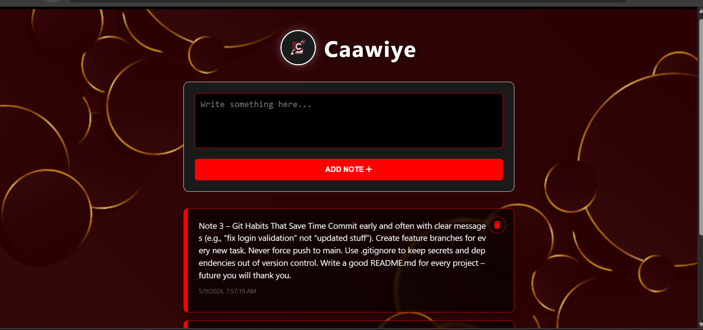

# 📝 Caawiye Notes

A simple and elegant note‑taking app built with **JavaScript, HTML, and CSS**. Your notes are saved automatically in the browser using `localStorage`, so they persist even after closing the page.

---

## 📖 Description
Caawiye Notes allows you to quickly write, save, and delete personal notes. Each note is timestamped with the current date and time. The design features a dark interface with red accents, a background image, and a translucent overlay for a clean, focused writing experience.

---

## ✨ Features
- ➕ Add new notes with a timestamp  
- 🗑️ Delete notes with a confirmation prompt  
- 💾 Automatic local storage – notes are never lost  
- 🎨 Custom design with glowing red borders and blur effect  
- 📱 Responsive layout that works on mobile and desktop  

---

## 🧠 Concepts Used
- 🧩 DOM manipulation (`createElement`, `innerHTML`)  
- 💾 `localStorage` for persistent data storage  
- 🔁 Array methods (`push`, `splice`, `forEach`)  
- 🖱️ Event handling (`onclick`)  
- 🎨 CSS pseudo‑elements and `backdrop-filter` for visual effects  
- 📅 JavaScript `Date` object for timestamps  

---

## 📸 App Preview

  

---

## 🚀 How to Run
1. Clone or download the project folder.  
2. Make sure the following assets exist in the `assets/` folder:  
   - `caawiye_logo.png` (logo image)  
   - `background.jpg` (background image)  
3. Open `index.html` in any modern web browser.  
4. Write your note, click **Add Note**, and it will be saved automatically.  

---

## 📌 Project Goal
This project was created to practice **core JavaScript concepts**: working with arrays, manipulating the DOM, storing data locally, and building a complete mini‑application from scratch without external frameworks.

---

## 👨‍💻 Author
**Mustafe-xasan**