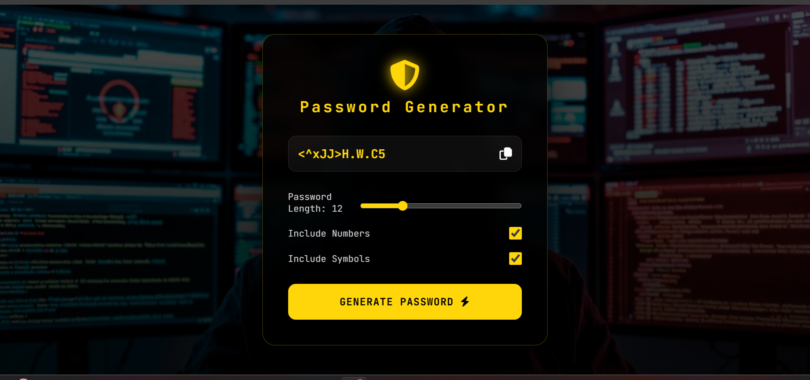

# 🔐 Password Generator

A secure and customizable password generator built with **JavaScript, HTML, and CSS**. Generate strong passwords with adjustable length, numbers, and special symbols – all in real time.

---

## 📖 Description
This application creates random passwords based on user preferences. You can choose the password length (6–30 characters), include numbers, and include symbols. The generated password is displayed in a read-only field and can be copied to your clipboard with one click. The design features a dark theme with a glowing yellow accent and a blurred background.

---

## ✨ Features
- 🔢 Adjustable password length (6–30 characters)  
- 🔠 Always includes uppercase and lowercase letters  
- 🔢 Option to include numbers (0‑9)  
- 🔣 Option to include special symbols  
- 📋 One‑click copy to clipboard  
- ⚡ Generates a password immediately on page load  
- 🎨 Smooth animations and responsive design  

---

## 🧠 Concepts Used
- 🧩 DOM manipulation (`getElementById`, `addEventListener`)  
- 🎲 Random string generation with `Math.random()`  
- 📋 Clipboard API (`navigator.clipboard.writeText`)  
- 🎚️ Range slider input handling  
- ✅ Checkbox state management  
- 🎨 CSS variables (`:root`), flexbox, keyframe animations  
- 📱 Responsive design with media queries  

---

## 📸 App Preview

  

---

## 🚀 How to Run
1. Clone or download the project folder.  
2. Make sure the `assets/bg.jpg` exists (or update the CSS background image path).  
3. Open `index.html` in any modern web browser.  
4. Adjust the length and checkboxes – a new password is generated automatically every time you click **GENERATE PASSWORD** or refresh the page.  

---

## 📌 Project Goal
This project was built to practice **client‑side randomness, secure password generation, and browser APIs** like the Clipboard API. It reinforces working with range inputs, checkboxes, and event listeners without any external libraries.

---

## 👨‍💻 Author
**Mustafe-xasan**