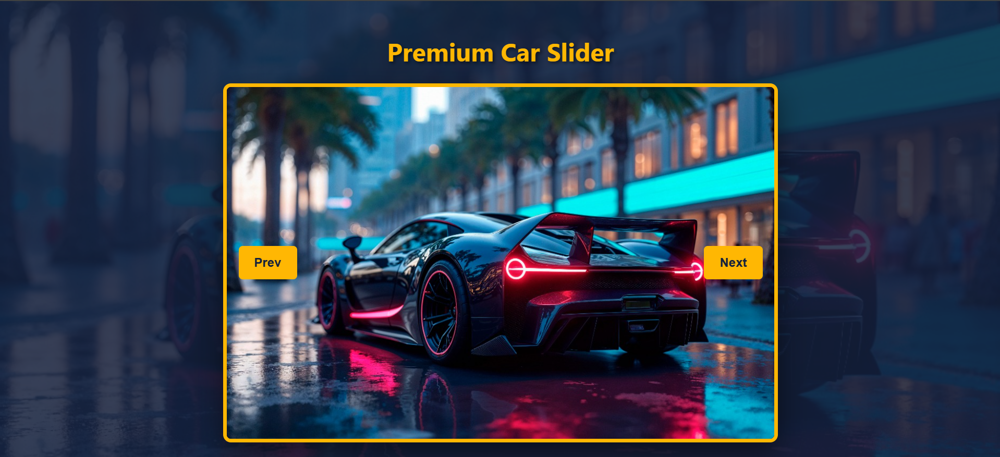

# 🚗 Layliye – Car Slider

A simple and elegant image slider built with **JavaScript, HTML, and CSS**. Browse through a collection of premium car images with previous and next buttons.

---

## 📖 Description
This project displays a set of car images in a centered slider. Users can click **Prev** or **Next** to navigate through the images. The slider loops automatically: when you reach the last image, clicking Next takes you back to the first one; clicking Prev from the first image takes you to the last one. The design features a dark overlay, golden borders, and responsive layout.

---

## ✨ Features
- 🖼️ Image slider with manual navigation  
- 🔁 Infinite looping (wraps around at both ends)  
- 🎨 Full‑screen background overlay for focus  
- 📱 Responsive design – works on mobile and desktop  
- 🧩 Clean and minimal interface  

---

## 🧠 Concepts Used
- 🧩 DOM manipulation (`getElementById`, `addEventListener`)  
- 📦 Array iteration and index management  
- 🔄 Looping logic with conditional checks  
- 🎨 CSS positioning (`absolute`, `relative`, `transform`)  
- 📱 Media queries for responsive layout  

---

## 📸 App Preview

  

---

## 🚀 How to Run
1. Clone or download the project folder.  
2. Make sure the following images exist in the `assets/` folder:  
   - `car1.jpg`  
   - `car2.jpg`  
   - `car3.jpg`  
3. (Optional) Update the background image path in CSS if needed.  
4. Open `index.html` in any modern web browser.  
5. Click **Prev** or **Next** to browse the images.

---

## 📌 Project Goal
This project was created to practice **basic JavaScript event handling, array manipulation, and DOM updates** while building a reusable image slider component without external libraries.

---

## 👨‍💻 Author
**Mustafe-xasan**