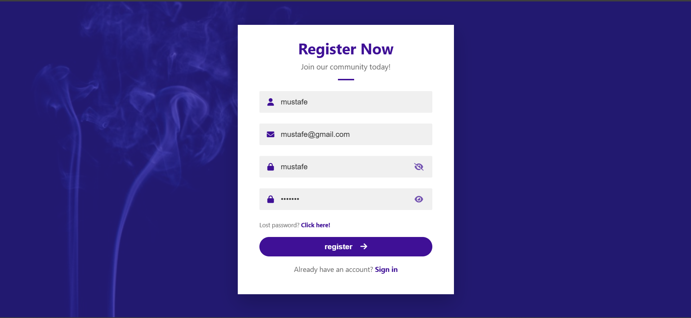

# 📝 Hage – Sign Up Form Validation

A fully interactive sign‑up form with **real‑time client‑side validation**, password visibility toggling, and elegant styling – built with **JavaScript, HTML, and CSS**.

---

## 📖 Description
This project is a registration form that validates user input before submission. It checks for a valid username (3–15 alphanumeric characters), a properly formatted email address, a strong password (minimum 6 characters with at least one number), and matching password confirmation. Error messages appear dynamically below each field, and the form only submits when all inputs are correct. The design includes a purple theme, background overlay, and eye icons to reveal/hide passwords.

---

## ✨ Features
- ✅ Real‑time validation with inline error messages  
- 🔒 Password strength check (minimum 6 chars + at least 1 digit)  
- 🔁 Confirm password matching  
- 👁️ Toggle password visibility (show/hide)  
- 📧 Email format validation using regex  
- 🧑 Username validation (alphanumeric, 3‑15 characters)  
- 🧹 Clears errors automatically when user starts typing  
- 🎨 Clean UI with icons, gradients, and responsive layout  

---

## 🧠 Concepts Used
- 🧩 DOM manipulation (`getElementById`, `addEventListener`)  
- 📋 Regular expressions (RegEx) for validation  
- 🖱️ Event handling (`onsubmit`, `onkeyup`, `onclick`)  
- 🔁 Array iteration for clearing errors  
- 🎨 CSS pseudo‑classes, absolute positioning, and overlays  
- 📱 Responsive design with media queries  

---

## 📸 App Preview

  

---

## 🚀 How to Run
1. Clone or download the project folder.  
2. Make sure the `assets/smoke.jpg` exists (or update the CSS background image path).  
3. Open `index.html` in any modern web browser.  
4. Fill in the fields – errors will appear if validation fails.  
5. When all fields are valid, clicking **Register** shows a success alert.

---

## 📌 Project Goal
This project was built to practice **client‑side form validation**, regular expressions, dynamic error messaging, and enhancing user experience with features like password toggling – all without any external validation libraries.

---

## 👨‍💻 Author
**Mustafe-xasan**